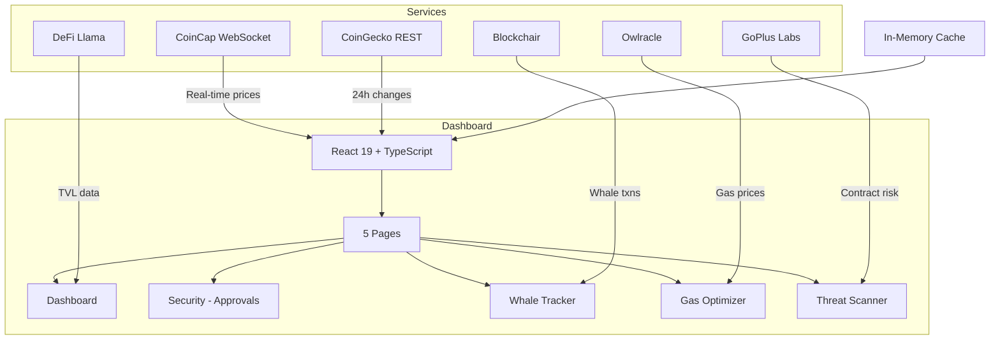

# ChainGuard

**Real-time DeFi risk intelligence across 7 chains — rug pull detection, whale tracking, gas optimization, and portfolio risk scoring.**


<!-- Add screenshot or demo GIF here -->
> Replace this with a screenshot of the dashboard showing risk scores and live price tickers

---

## The Problem

DeFi moves fast. Rug pulls, honeypots, and whale dumps happen in minutes. By the time you check Etherscan, it's too late.

**ChainGuard monitors 7 chains in real-time** — scoring smart contracts for risk, tracking whale movements, comparing gas prices, and managing your token approvals. All from a single dashboard, powered by 6 free public APIs.

---

## Table of Contents

- [Features](#features)
- [Quick Start](#quick-start)
- [Architecture](#architecture)
- [Data Sources](#data-sources)
- [Risk Scoring](#risk-scoring)
- [Tech Stack](#tech-stack)
- [Roadmap](#roadmap)
- [Contributing](#contributing)

---

## Features

| | Feature | Description |
|---|---------|-------------|
| :shield: | **Smart Contract Scanner** | Honeypot detection, hidden mints, tax analysis, liquidity locks via GoPlus Labs |
| :whale: | **Whale Tracker** | Real-time large wallet movements with buy/sell sentiment (Blockchair + CoinCap) |
| :fuelpump: | **Gas Optimizer** | Cross-chain gas comparison (6 EVM chains + Solana) with timing recommendations |
| :chart_with_upwards_trend: | **Portfolio Dashboard** | Live prices (WebSocket), risk metrics (VaR, Sharpe, drawdown), DeFi health factors |
| :lock: | **Approval Manager** | Detect unlimited approvals, unverified contracts, revoke with one click |
| :bank: | **DeFi Monitor** | TVL tracking for Aave, Uniswap, GMX, Lido, Curve, Compound via DeFi Llama |

### Supported Chains

Ethereum, BNB Chain, Polygon, Arbitrum, Solana, Base, Avalanche

---

## Quick Start

```bash
git clone https://github.com/beepboop2025/chainguard.git
cd chainguard
npm install
npm run dev
```

Opens at `http://localhost:5173`. **No API keys required** — all APIs are free tier.

```bash
npm run build     # Production build
npm run preview   # Preview production build
```

---

## Architecture



All API calls are cached with TTL (15s-300s). Stale data served on API failure.

---

## Data Sources

| Service | Purpose | Cache TTL | API Key |
|---------|---------|:---------:|:-------:|
| CoinCap WebSocket | Real-time streaming prices | Live | No |
| CoinGecko REST | 24h price changes, market cap | 120s | No |
| GoPlus Labs | Smart contract security analysis | 300s | No |
| Owlracle | Cross-chain gas prices (4 tiers) | 15s | No |
| DeFi Llama | Protocol TVL and yield data | 120s | No |
| Blockchair | Bitcoin large transactions | 300s | No |

---

## Risk Scoring

### Portfolio Risk Score (0-100)

```
Base: 100 points
- Per high-risk DeFi position: -6
- Per medium-risk position: -3
- Low health factor (<1.5): -8
- Per critical approval: -10
- Per high-risk approval: -5
- Unlimited unverified approval: -4
```

### Smart Contract Risk Score (0-100)

| Flag | Points |
|------|:------:|
| Honeypot detected | +30 |
| Hidden mint function | +20 |
| High tax (>10%) | +25 |
| No audit | +15 |
| Owner not renounced | +10 |
| Proxy contract | +10 |
| Blacklist function | +10 |
| Anti-whale mechanism | +5 |

Score < 40 = Safe. Score > 70 = High Risk.

---

## Tech Stack

| Component | Technology |
|-----------|-----------|
| Framework | React 19, TypeScript 5.9 |
| Build | Vite 7.3 |
| Styling | Tailwind CSS 4, Framer Motion |
| Charts | Recharts 3.8 |
| Icons | Lucide React |
| Routing | React Router DOM 7 |
| State | React hooks (no external state lib) |

---

## Roadmap

- [ ] Wallet connection (MetaMask, WalletConnect) for real portfolio data
- [ ] Push notifications for whale movements and gas price drops
- [ ] Historical risk score tracking per token
- [ ] Multi-wallet portfolio aggregation
- [ ] Mobile app (React Native)

---

## Contributing

PRs welcome. The codebase is modular — services in `src/services/`, hooks in `src/hooks/`, pages in `src/pages/`.

[Open an issue](https://github.com/beepboop2025/chainguard/issues) for bugs or feature requests.
